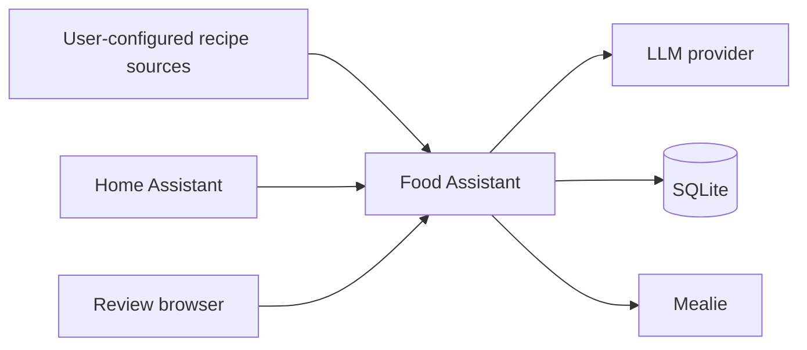

# Food Assistant

Food Assistant is a self-hosted FastAPI middleware for turning user-supplied
recipe sources into reviewed, normalized recipes in Mealie. It combines an LLM
provider, deterministic quality checks, a browser review workflow, idempotent
Mealie imports, and APIs suitable for Home Assistant automations.

> AI-generated cooking instructions can be wrong. Verify allergens, food
> temperatures, storage guidance, and other food-safety details yourself.

## Features

- Ollama and OpenAI-compatible structured-chat providers
- Recipe normalization, schema repair, quality gates, and duplicate detection
- Human review at `/review`, optional automatic approval, and batch processing
- Idempotent Mealie import with read-back verification and retries
- Inventory and meal recommendation APIs for Home Assistant
- API-token authentication for all `/api/v1/*` endpoints
- SQLite persistence and Docker Compose deployment



## Screenshot

Screenshots are intentionally not bundled yet. The review interface is
available at `/review` after deployment.

## Quick start

```bash
cp .env.example .env
mkdir -p data secrets
```

Create long random values for the Food Assistant and Mealie credentials. For a
Docker Secrets deployment, write one secret per file under `secrets/`, then run:

```bash
docker compose -f compose.yaml -f compose.auth.yaml up -d --build
```

Alternatively, keep secret files outside the repository and set
`FOOD_ASSISTANT_API_TOKEN_HOST_FILE` and `MEALIE_TOKEN_HOST_FILE` in `.env` to
their absolute host paths. The files are still mounted at `/run/secrets/...`
inside the container. Do not set `COMPOSE_FILE`; use the explicit `-f` commands
shown here so the active overlays are unambiguous.

For server-side environment variables instead, set the token variables in
`.env` and run:

```bash
docker compose up -d --build
```

Open `http://localhost:8787/review`. Protect this page with HTTPS and reverse
proxy authentication before exposing it outside a trusted network.

## Provider examples

Ollama:

```dotenv
LLM_PROVIDER=ollama
LLM_BASE_URL=http://host.docker.internal:11434
LLM_MODEL=qwen3:8b
LLM_CONTEXT_LENGTH=6144
```

OpenAI-compatible API:

```dotenv
LLM_PROVIDER=openai_compatible
LLM_BASE_URL=https://api.example.com/v1
LLM_API_KEY_FILE=/run/secrets/llm_api_key
LLM_MODEL=example-model
```

To mount the LLM key as a Docker Secret, add
`-f compose.llm-secret.yaml` to the Compose command. The host file defaults to
the ignored `secrets/llm_api_key`; set `LLM_API_KEY_HOST_FILE` to use an
absolute host path instead:

```bash
docker compose -f compose.yaml -f compose.auth.yaml \
  -f compose.llm-secret.yaml up -d --build
```

OpenAI-compatible mode is designed for services such as DeepSeek, OpenRouter,
LM Studio, vLLM, and LiteLLM. Compatibility depends on the service and model.
See [provider configuration](docs/providers.md).

## Mealie and API authentication

Set `MEALIE_BASE_URL` and provide a Mealie token through `MEALIE_TOKEN_FILE`
(recommended) or `MEALIE_TOKEN`. Protect Food Assistant with
`FOOD_ASSISTANT_API_TOKEN_FILE` or `FOOD_ASSISTANT_API_TOKEN`. Use a unique,
random token of at least 32 characters.

## Data and backups

Persistent state lives in the host directory selected by
`FOOD_ASSISTANT_DATA_DIR` (default `./data`). Back up the SQLite database only
with a SQLite-aware method or while the service is stopped, and separately back
up your secret files. Test restoration periodically. Runtime data, source
clones, caches, logs, databases, and backups are excluded from Git.

## Privacy and security

Recipe text sent for normalization is transmitted to the configured LLM
provider. With a remote provider, review that provider's retention and training
policy. AI API keys are used only on the server; the browser UI has no AI-key
input and must never receive an AI API key. See [privacy](docs/privacy.md) and
[security policy](SECURITY.md).

## Recipe sources and affiliations

This project does **not** include or redistribute HowToCook recipes, source
repositories, images, or databases. Users configure and synchronize their own
sources and are responsible for following every source's license and terms.

Food Assistant is not officially affiliated with Mealie, HowToCook, Ollama,
DeepSeek, OpenAI, OpenRouter, LM Studio, vLLM, LiteLLM, or their maintainers.

## Documentation

- [Architecture](docs/architecture.md)
- [Configuration](docs/configuration.md)
- [Providers](docs/providers.md)
- [Deployment](docs/deployment.md)
- [API](docs/api.md)
- [Privacy](docs/privacy.md)
- [Troubleshooting](docs/troubleshooting.md)

## Roadmap

- More provider-specific compatibility tests
- Stronger database migration tooling
- Optional observability integrations without sensitive payload logging
- More Home Assistant examples and localization

Contributions are welcome; read [CONTRIBUTING.md](CONTRIBUTING.md). This project
is available under the [MIT License](LICENSE).
