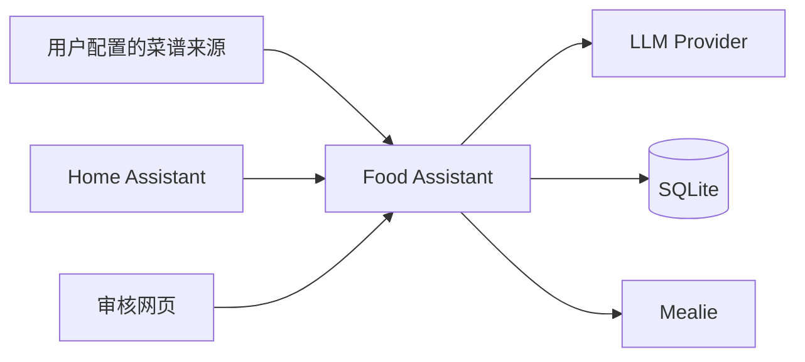

# Food Assistant

Food Assistant 是一个自托管 FastAPI 中间层，将用户自行配置的菜谱来源经过
AI 标准化、规则校验和人工审核后，安全且幂等地导入 Mealie，并提供适合 Home
Assistant 调用的 API。

> AI 生成的烹饪内容可能错误。过敏原、熟化温度、保存方式等食品安全信息必须由
> 用户自行核对。

## 主要功能

- 支持 Ollama 与 OpenAI-compatible LLM provider
- 菜谱标准化、Schema 修复、质量门、去重与重试
- `/review` 人工审核、自动批准和批处理
- Mealie 幂等导入、回读验证和原生实体映射
- 库存及推荐 API，可供 Home Assistant 使用
- 所有 `/api/v1/*` 接口使用 API Token 认证
- SQLite 持久化与 Docker Compose 部署



## 截图

当前仓库暂不附带截图。部署后可通过 `/review` 打开审核界面。

## 快速开始

```bash
cp .env.example .env
mkdir -p data secrets
docker compose -f compose.yaml -f compose.auth.yaml up -d --build
```

请在 `secrets/` 中分别创建 Food Assistant 和 Mealie 密钥文件。
也可以在 `.env` 中通过 `FOOD_ASSISTANT_API_TOKEN_HOST_FILE` 和
`MEALIE_TOKEN_HOST_FILE` 指向仓库外的宿主机绝对路径；容器内仍挂载到
`/run/secrets/...`。不要设置 `COMPOSE_FILE`，请显式使用上面的 `-f` 参数，避免
实际加载的 overlay 不明确。
也可以只在服务端 `.env` 使用环境变量，然后执行 `docker compose up -d --build`。
不要把 `.env` 或 secret 文件提交到 Git。

浏览 `http://localhost:8787/review`。若需要公网访问，必须先配置 HTTPS、API
认证，并建议在反向代理或 Cloudflare Tunnel 层再次保护 `/review`。

## Ollama 示例

```dotenv
LLM_PROVIDER=ollama
LLM_BASE_URL=http://host.docker.internal:11434
LLM_MODEL=qwen3:8b
LLM_CONTEXT_LENGTH=6144
```

旧的 `OLLAMA_BASE_URL`、`OLLAMA_MODEL`、`OLLAMA_TIMEOUT_SECONDS`、
`OLLAMA_NUM_CTX` 和 `OLLAMA_KEEP_ALIVE` 仍兼容；对应的新 `LLM_*` 变量优先。

## OpenAI-compatible 示例

```dotenv
LLM_PROVIDER=openai_compatible
LLM_BASE_URL=https://api.example.com/v1
LLM_API_KEY_FILE=/run/secrets/llm_api_key
LLM_MODEL=example-model
```

若以 Docker Secret 提供 LLM Key，请创建 `secrets/llm_api_key`，或通过
`LLM_API_KEY_HOST_FILE` 指向仓库外的宿主机绝对路径，并执行：

```bash
docker compose -f compose.yaml -f compose.auth.yaml \
  -f compose.llm-secret.yaml up -d --build
```

该模式面向 DeepSeek、OpenRouter、LM Studio、vLLM、LiteLLM 等常见兼容服务，
实际能力取决于上游和模型。详见 [Provider 文档](docs/providers.md)。

## Mealie、认证和数据目录

通过 `MEALIE_BASE_URL` 配置 Mealie，并使用 `MEALIE_TOKEN_FILE`（推荐）或
`MEALIE_TOKEN` 提供凭据。通过 `FOOD_ASSISTANT_API_TOKEN_FILE`（推荐）或
`FOOD_ASSISTANT_API_TOKEN` 保护业务 API，令牌应随机且至少 32 字符。

运行数据位于 `FOOD_ASSISTANT_DATA_DIR`（默认 `./data`）。数据库、日志、缓存、
source clone 和备份均被 Git 排除。建议停止服务后备份，或使用 SQLite 一致性备份
方式，并定期验证恢复流程。

## 隐私、安全和数据来源

待标准化的菜谱文本会发送到用户配置的 LLM provider。使用远程服务前请了解其
数据保留和训练政策。AI API Key 仅在服务端使用；浏览器没有 AI Key 输入框，也
不应接触 AI API Key。

本项目不内置或重新分发 HowToCook 菜谱正文、克隆仓库、图片或数据库。菜谱源由
用户自行配置和同步，用户有责任遵守相应许可证和使用条款。

本项目与 Mealie、HowToCook、Ollama、DeepSeek、OpenAI、OpenRouter、LM
Studio、vLLM、LiteLLM 及其维护者没有官方隶属关系。

详细资料见 [配置](docs/configuration.md)、[部署](docs/deployment.md)、
[API](docs/api.md)、[隐私](docs/privacy.md)、[安全政策](SECURITY.md) 和
[排障](docs/troubleshooting.md)。路线图包括更多 provider 兼容测试、正式迁移工具、
可选可观测性以及更多 Home Assistant 示例。

欢迎参阅 [贡献指南](CONTRIBUTING.md)。项目使用 [MIT License](LICENSE)。
