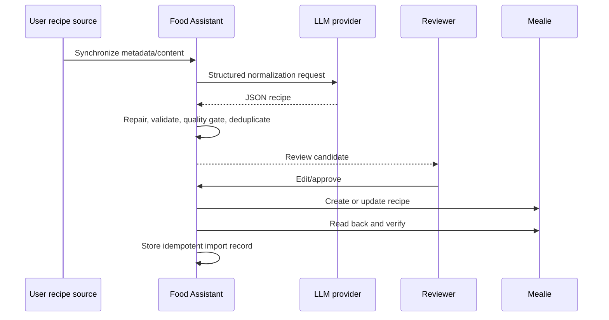

# Architecture

Food Assistant is a single FastAPI service with a browser review page and a
SQLite database. Routers cover inventory, recommendations, user-configured
recipe sources, AI normalization, import queues, Mealie integration, and system
status. SQLAlchemy models are created at startup; small historical migrations
are applied by application code rather than Alembic.

`app/llm/` owns provider configuration, construction, JSON extraction, and
sanitized errors. Business code asks the provider factory for structured chat.
The compatibility module `app/ollama_client.py` retains historical imports.

All `/api/v1/*` requests pass through constant-time API-token authentication.
Health, readiness, documentation, and the `/review` HTML document are outside
that middleware; the review page cannot read protected data without a token.
